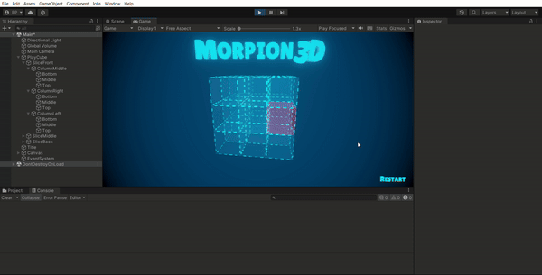

# TP Morpion 3D
## Groupe 9

### Algorithme pour identifier un gagnant:
- on parcourt les lignes dans les 3 dimensions grâce à deux boucles pour voir si les 3 cases ont la même valeur
- on parcourt les deux diagonales passant par chaque plan grâce à une boucle
- on parcourt les quatre grandes diagonales
